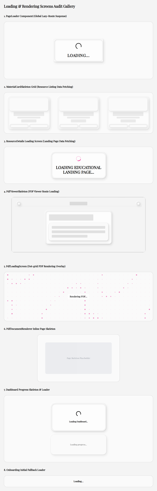

# Loading, Skeleton & Rendering Screens Audit Report

This report catalogs all **8 loading screens, skeleton components, spinner indicators, and rendering overlays** across the Horizon codebase. Each screen is named according to its exact location and component context, accompanied by visual screenshot artifacts stored in `docs/screenshots/`.

---

## Visual Overview & Complete Gallery

---

## Detailed Catalog of Loading & Rendering Screens

### 1. Global Route Suspense PageLoader
* **Screenshot File:** [`01-global-route-suspense-page-loader.png`](./01-global-route-suspense-page-loader.png)
* **Component Path:** `src/components/loading/PageLoader.tsx`
* **Trigger Location / Route:** Global layout wrapper (`MainLayout.tsx`) during route-level lazy loading (`React.lazy` chunk fetching for `/library`, `/notes`, `/dashboard`, etc.), and `/onboarding` initial suspense fallback.
* **Phase:** Initial Route Transition Phase (Phase 1).
* **Purpose:** Acts as a generic lazy component fallback when navigating to dynamic route chunks that have not yet been fetched by the browser.
* **Visual Composition:** Centered neumorphic card (`neu-card`) with a 12x12 border-ink spinning wheel and uppercase "LOADING..." typography.

### 2. Resource Listing MaterialCard Skeleton Grid
* **Screenshot File:** [`02-resource-listing-material-card-skeleton.png`](./02-resource-listing-material-card-skeleton.png)
* **Component Path:** `src/components/MaterialCardSkeleton.tsx`
* **Trigger Location / Route:** `/library` and `/notes` resource listing pages (`ResourcePage.tsx`).
* **Phase:** Resource Metadata Data Fetching Phase (Phase 2).
* **Purpose:** Displays high-fidelity neumorphic skeleton card placeholders while fetching resource items from Supabase, matching exact dimensions of resource cards (`MaterialCard.tsx`).
* **Visual Composition:** Animated pulsing card grid containing thumbnail placeholder, title lines, subtitle line, and dual action button skeletons.

### 3. Resource Details Landing Page Loader
* **Screenshot File:** [`03-resource-details-landing-page-loader.png`](./03-resource-details-landing-page-loader.png)
* **Component Path:** `src/pages/resources/ResourceDetails.tsx`
* **Trigger Location / Route:** `/resource/:id` public educational summary page.
* **Phase:** Educational Landing Metadata Data Fetching Phase (Phase 2).
* **Purpose:** Displays a centered loader card while fetching detailed chapter and learning resource metadata from Supabase.
* **Visual Composition:** Neumorphic card with pink accent circular spinner (`#E91E8C`) and primary `<h1>` heading "LOADING EDUCATIONAL LANDING PAGE...".

### 4. PDF Viewer Route Skeleton
* **Screenshot File:** [`04-pdf-viewer-route-skeleton.png`](./04-pdf-viewer-route-skeleton.png)
* **Component Path:** `src/components/PdfViewerSkeleton.tsx`
* **Trigger Location / Route:** `/view/:id` PDF Viewer route (`App.tsx` Suspense & `PdfViewer.tsx` initial data fetch).
* **Phase:** Document Viewer Initialization Phase (Phase 1).
* **Purpose:** Full-screen layout skeleton placeholder that matches the top controls bar and document canvas shell while lazy-loading the PDF viewer code chunk and fetching signed Supabase storage URLs.
* **Visual Composition:** Full-screen pulsing fixed overlay with mock top header bar (back button, title bar, controls) and document card skeleton.

### 5. PDF Viewer Dot-Grid Rendering Overlay
* **Screenshot File:** [`05-pdf-viewer-dot-grid-rendering-screen.png`](./05-pdf-viewer-dot-grid-rendering-screen.png)
* **Component Path:** `src/components/PdfLoadingScreen.tsx`
* **Trigger Location / Route:** `/view/:id` inside `PdfViewer.tsx` canvas area.
* **Phase:** PDF Document Parsing & Web Worker Rendering Phase (Phase 2).
* **Purpose:** Renders an interactive animated dot-grid overlay while PDF.js initializes, downloads the PDF binary stream, and compiles pages into canvas memory.
* **Visual Composition:** Dynamic resize-observed dot-grid array with sine-wave organic pulse animation and floating "Rendering PDF..." status message.

### 6. PDF Document Renderer Inline Page Skeleton
* **Screenshot File:** [`06-pdf-document-renderer-inline-page-skeleton.png`](./06-pdf-document-renderer-inline-page-skeleton.png)
* **Component Path:** `src/pages/resources/pdf-viewer/components/PdfDocumentRenderer.tsx`
* **Trigger Location / Route:** `/view/:id` individual PDF page canvas loading state.
* **Phase:** Individual Page Viewport Render Phase (Phase 3).
* **Purpose:** Inline grey skeleton placeholder rendered for individual PDF pages prior to complete canvas rasterization.
* **Visual Composition:** Pulsing grey rectangle (`h-64 w-full animate-pulse bg-gray-200 rounded-md`).

### 7. User Dashboard Progress Skeleton & Loader
* **Screenshot File:** [`07-user-dashboard-progress-loader.png`](./07-user-dashboard-progress-loader.png)
* **Component Path:** `src/pages/user/Dashboard.tsx`
* **Trigger Location / Route:** `/dashboard` user profile page.
* **Phase:** Auth Profile & Progress Data Loading Phase (Phase 2).
* **Purpose:** Displays loader card ("Loading Dashboard...") during auth resolution and a recessed skeleton box ("Loading progress...") while `useDashboardProgress` calculates chapter completion stats.
* **Visual Composition:** Neumorphic card spinner and recessed pulsing stat card fallback.

### 8. Onboarding Initial Fallback Loader
* **Screenshot File:** [`08-onboarding-initial-fallback-loader.png`](./08-onboarding-initial-fallback-loader.png)
* **Component Path:** `src/pages/onboarding/Onboarding.tsx`
* **Trigger Location / Route:** `/onboarding` route during auth profile check.
* **Phase:** Auth Verification Phase (Phase 1).
* **Purpose:** Bare text loader displayed during profile status verification.
* **Visual Composition:** Minimalist centered text (`Loading...`).

---

## Chronological User Journey Sequences

### Journey A: Browsing Educational Resources (`/library` or `/notes`)
1. **Phase 1 (Route Suspense):** `PageLoader` (`01-global-route-suspense-page-loader.png`) appears briefly while dynamic JS route chunk loads, then disappears.
2. **Phase 2 (Data Fetching):** `MaterialCardSkeleton` grid (`02-resource-listing-material-card-skeleton.png`) renders inside page layout until resource items arrive from Supabase, then seamlessly transitions to `MaterialCard` items.

### Journey B: Viewing Public Educational Landing Page (`/resource/:id`)
1. **Phase 1 (Route Suspense):** `PageLoader` (`01-global-route-suspense-page-loader.png`) appears during JS chunk download, then disappears.
2. **Phase 2 (Data Fetching):** `ResourceDetails` Loader (`03-resource-details-landing-page-loader.png`) displays while reading public chapter metadata, disappearing once the editorial content layout renders.

### Journey C: Opening Protected Document Viewer (`/view/:id`)
1. **Phase 1 (Route & Auth Initialization):** `PdfViewerSkeleton` (`04-pdf-viewer-route-skeleton.png`) replaces empty screen during viewer route suspension and signed URL retrieval.
2. **Phase 2 (PDF Binary Compilation):** `PdfLoadingScreen` (`05-pdf-viewer-dot-grid-rendering-screen.png`) displays over document canvas while PDF.js compiles pages.
3. **Phase 3 (Individual Page Rasterization):** `PdfDocumentRenderer` Inline Page Skeleton (`06-pdf-document-renderer-inline-page-skeleton.png`) flashes for viewport canvas rasterization before page rendering completes.

### Journey D: User Dashboard (`/dashboard`)
1. **Phase 1 (Route Suspense):** `PageLoader` (`01-global-route-suspense-page-loader.png`) displays during route code splitting.
2. **Phase 2 (Auth & Progress Fetching):** `Dashboard` Loader & Progress Skeleton (`07-user-dashboard-progress-loader.png`) displays until profile and study history calculate, then reveals dashboard metrics.

---

## Standardization & Rationalization Recommendations

1. **Standardize Spinner Indicators:**
   - **Current State:** Wheel spinners use 3 different styles (`border-ink` black wheel in `PageLoader`, pink `#E91E8C` wheel in `ResourceDetails`, and standard black wheel in `Dashboard`).
   - **Recommendation:** Unify all spinner elements into a standardized neumorphic spinner component matching primary theme colors.

2. **Replace Plain Text Fallbacks:**
   - **Current State:** `/onboarding` uses unstyled plain text (`Loading...`).
   - **Recommendation:** Replace unstyled text fallbacks with `PageLoader` or a dedicated onboarding skeleton container.

3. **Align Skeleton Styling:**
   - **Current State:** `MaterialCardSkeleton` and `PdfViewerSkeleton` use neumorphic tokens (`neu-raised`, `neu-recessed`), while `PdfDocumentRenderer` inline page skeleton uses raw Tailwind (`bg-gray-200`).
   - **Recommendation:** Update inline document page skeletons to use neumorphic recessed styling (`neu-recessed`) for complete aesthetic consistency.
